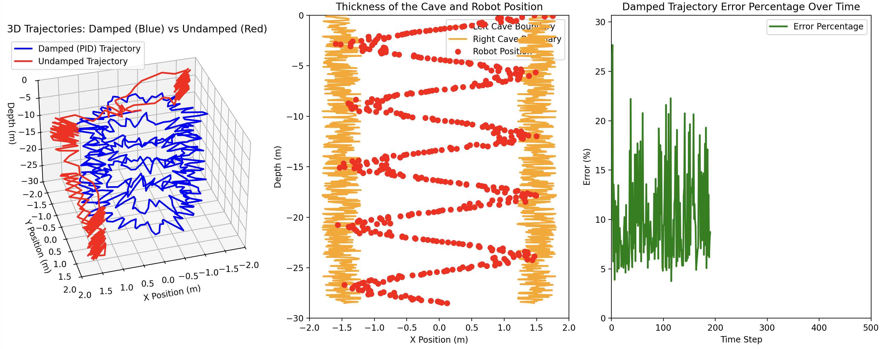

# Into the Ice: Robot Cave Navigation Simulation

This simulation is based on the paper: Polzin, M., & Hughes, J. (2024). *Into the ice: Exploration and data capturing in glacial moulins by a tethered robot*. Journal of Field Robotics, 41(3), 654-668. 
[[See the full paper]](https://www.authorea.com/users/591473/articles/627409-into-the-ice-exploration-and-data-capturing-in-glacial-moulins-by-a-tethered-robot)



https://github.com/user-attachments/assets/64ca8fcd-dacd-4eae-be79-2b943fdf6a0d

This project simulates the movement of a robot descending into a cave of varying thickness using a PID controller to stay within the boundaries. 

## Installation Guide

To get started with the simulation, follow these steps:

1. **Clone the repository:**
    ```sh
    git clone https://github.com/souvik0306/Into_the_Ice.git
    cd Into_the_Ice
    ```

2. **Install the required dependencies:**
    ```sh
    pip install -r requirements.txt
    ```

3. **Run the main application:**
    ```sh
    python app.py
    ```

4. **Run the Open3D visualization:**
    ```sh
    python app_open3d.py
    ```

## Here's a breakdown of the components:

### 1. Constants (`constants.py`)
Defines simulation parameters:
- Cave length
- Depth points
- Spiral rotations
- Noise amplitude
- PID gain values

### 2. PID Controller (`pid_controller.py`)
Calculates the necessary velocity adjustments based on:
- Current position error
- Integral of past errors
- Rate of change of error

Uses the classic PID formula to output control signals for both x and y directions.

### 3. Simulation (`simulation.py`)
Simulates the robot's movement:
- Generates random cave boundaries (`left_thickness`, `right_thickness`) to represent the varying width of the cave.
- Calculates the desired path as a spiral.
- Simulates two trajectories:
    - **Undamped**: Moves freely within the cave boundaries with added noise.
    - **Damped (PID Controlled)**: Uses the PID controller to adjust its velocity to stay close to the desired spiral path while remaining within the cave boundaries.

Tracks the robot's position, calculates the error between the damped and desired trajectories, and stores this data.

### 4. Plotting (`plotting.py`)
Initializes the Matplotlib figures and axes for:
- Cave thickness visualization
- Error percentage plot

#### `update_main_plot`
Updates the data for the 3D and thickness plots during the animation.

#### `update_error_plot`
Updates the error percentage plot during the animation.

### 5. Main Application (`app.py`)
- Calls `run_simulation` to get the simulated data.
- Uses `setup_plots` to initialize the plots.
- Creates two `FuncAnimation` instances:
    - One for the main plot (3D trajectory and thickness).
    - One for the error plot.
- Shows the plots with the animations running.

### 6. Open3D Visualization (`app_open3d.py`)
- Creates and deforms a cylindrical mesh to represent the cave.
- Applies Perlin noise to the mesh vertices to simulate natural cave walls.
- Simulates the robot's path inside the cave.
- Visualizes the cave and robot path using Open3D.

## Summary
The codebase simulates a robot navigating a cave with varying thickness. It uses a PID controller to keep the robot on a desired spiral path while avoiding collisions with the cave walls. The simulation results are visualized using Matplotlib animations, showing the 3D trajectory, the cave thickness, and the error difference between damped and random movement. Additionally, `app_open3d.py` provides a 3D visualization of the cave and robot path using Open3D.